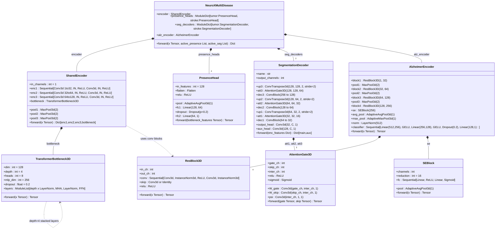
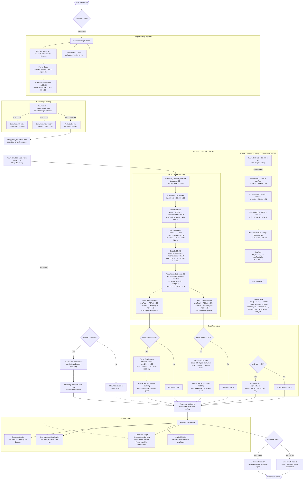

# NeuroX - Multi-Disease Brain MRI Analysis System

## 📋 Project Overview

NeuroX is an advanced deep learning system for automated detection and segmentation of brain pathologies from MRI scans. The system simultaneously analyzes three critical neurological conditions: **Brain Tumors**, **Stroke**, and **Alzheimer's Disease** using state-of-the-art 3D convolutional neural networks with uncertainty quantification.

### Project Goal

To develop a clinically-viable AI diagnostic assistant that:
- Provides accurate multi-disease detection from a single MRI scan
- Generates precise 3D visualizations of brain pathology
- Quantifies diagnostic uncertainty for clinical decision support
- Meets publication-grade statistical rigor for medical AI research

## ⚡ Quick Start

Get the system running in under 5 minutes:

1.  **Clone & Install**:
    ```bash
    git clone https://github.com/SaiKarthik547/Capstone.git
    cd Capstone
    pip install -r requirements.txt
    pip install HD-BET
    ```

2.  **Download Models**:
    - Place `neurox_model.pth` in the `checkpoints/` directory (generated by `neurox_train_kaggle.py`).
    - (Optional) Download HD-BET weights if not automatic.

3.  **Run**:
    ```bash
    streamlit run neurox_adaptive.py
    ```

---

## ⚠️ Disclaimer

**IMPORTANT LEGAL AND CLINICAL NOTICES:**

🚨 **NOT FOR CLINICAL USE** - This system is a research prototype and educational tool only. It is NOT approved by FDA, CE, or any regulatory body for clinical diagnosis or treatment decisions.

⚠️ **REQUIRES EXPERT SUPERVISION** - All outputs must be reviewed and validated by qualified medical professionals (radiologists, neurologists). AI predictions are assistive only and cannot replace human clinical judgment.

⚠️ **RESEARCH PURPOSES ONLY** - This software is intended for academic research, algorithm development, and educational demonstrations. Any clinical application requires proper regulatory approval and validation studies.

⚠️ **NO WARRANTY** - Provided "as-is" without any guarantees of accuracy, reliability, or fitness for any particular purpose. Users assume all risks.

⚠️ **DATA PRIVACY** - Users are responsible for ensuring compliance with HIPAA, GDPR, and other applicable data protection regulations when processing medical images.

---

## ✨ Key Features

### Multi-Label Disease Detection
- ✅ Simultaneous detection of Tumor, Stroke, and Alzheimer's Disease
- ✅ Independent probability scores (diseases are NOT mutually exclusive)
- ✅ One patient can have multiple conditions simultaneously

### Medical-Grade Brain Extraction
- ✅ HD-BET (Heidelberg Brain Extraction Tool) for accurate skull stripping
- ✅ Separates brain tissue from skull, scalp, and facial structures
- ✅ Essential for accurate 3D visualization

### 3D Visualization
- ✅ Interactive 3D brain mesh rendering
- ✅ Lesion overlay with anatomically accurate positioning
- ✅ Color-coded pathology visualization

### Uncertainty Quantification
- ✅ Monte Carlo Dropout for epistemic uncertainty estimation
- ✅ Confidence scores for each prediction
- ✅ Helps identify cases requiring expert review

### Training Dashboard
- ✅ Dedicated TRAINING page in the Streamlit app
- ✅ 80-epoch trend graphs for all metrics (Tumor Dice, Stroke Dice, AUC, F1)
- ✅ Phase transition annotations (P1 ALZ, P2 SEG, P3 JOINT)
- ✅ All-time best metrics displayed at a glance

### Clinical Metrics
- ✅ Comprehensive evaluation: Precision, Recall, F1-Score
- ✅ Sensitivity, Specificity, PPV, NPV
- ✅ Advanced Spatial Metrics: Volume (mm³), Centroid (mm), and Bounding Box in World Coordinates
- ✅ Clinical-style quantification using Affine Matrix transformations
- ✅ ROC curves and calibration analysis

---

## 🛠️ Technology Stack

### Core Framework
- **Python 3.8+** - Primary programming language
- **PyTorch 2.0+** - Deep learning framework
- **CUDA 11.8+** - GPU acceleration (optional)

### Medical Imaging
- **NiBabel** - NIfTI file I/O
- **HD-BET** - Medical-grade brain extraction
- **Scikit-image** - Image processing and marching cubes
- **SciPy** - Scientific computing and morphological operations

### Deep Learning Architecture
- **SharedEncoder** - 3D CNN (enc1→enc2→enc3, channels 1→32→64→128)
- **TransformerBottleneck3D** - Global context modeling (depth=4, heads=8, mlp_dim=256, dropout=0.2)
- **PresenceHead (Tumor/Stroke)** - Bottleneck → AvgPool → FC(128→64)→ReLU→Dropout(0.2)→FC(64→1)
- **AlzheimerEncoder v2** - Raw MRI → 4× ResBlock3D+SE layers → DualPool(avg+max) → LayerNorm(512) → MLP(512→256→128→1, GELU, Dropout=0.2)
- **SegmentationDecoder** - Attention-Gated U-Net (Tumor 3-class ET/NCR/ED, Stroke binary)
- **InstanceNorm3d** - Normalization for single-batch stability
- **Metrics-embedded Checkpoints** - `neurox_model.pth` stores weights + full 80-epoch training history

### Visualization
- **Streamlit** - Web application framework
- **Plotly** - Interactive 3D graphics and training trend charts
- **Trimesh** - 3D mesh processing
- **Matplotlib** - 2D plotting and analysis

### Evaluation & Statistics
- **Scikit-learn** - ML metrics and evaluation
- **Iterative-stratification** - Multi-label cross-validation
- **NumPy** - Numerical computing
- **Pandas** - Data analysis and subject-level splitting

### Report Generation
- **ReportLab** - PDF report creation
- **Groq AI** - Optional AI-powered insights (requires API key)

---

## 📦 Installation

### 1. Clone Repository
```bash
git clone https://github.com/SaiKarthik547/Capstone.git
cd Capstone
```

### 2. Install Python Dependencies
```bash
pip install -r requirements.txt
```

**Required packages:**
```
torch>=2.0.0
nibabel>=5.0.0
numpy>=1.24.0
scipy>=1.10.0
scikit-image>=0.20.0
scikit-learn>=1.3.0
streamlit>=1.28.0
plotly>=5.17.0
trimesh>=4.0.0
matplotlib>=3.7.0
reportlab>=4.0.0
iterative-stratification>=0.1.7
```

### 3. Install HD-BET (Medical-Grade Brain Extraction)
```bash
pip install HD-BET
```
**Verify installation:**
```bash
hd-bet -h
```
If successful, you should see HD-BET help documentation.

### 4. Download Model Weights
**Essential:**
1.  **NeuroX Model**: Place `neurox_model.pth` in the `checkpoints/` directory.
    - Generated by running `neurox_train_kaggle.py` (Kaggle GPU environment)
    - Format: `{"model_state": <weights>, "metrics": <80-epoch history>}`

**Optional (for 3D Brain Extraction):**
2.  **HD-BET Weights**: The system attempts to download these automatically. If it fails, place weights in `~/.hd-bet/`.

---

## 🚀 Usage

### Running the Application
```bash
streamlit run neurox_adaptive.py
```
The web interface will open automatically at `http://localhost:8501`.

### Workflow

1. **Upload MRI Scan**
   - Supported formats: `.nii`, `.nii.gz` (NIfTI)
   - Recommended: T1-weighted, T2-weighted, or FLAIR sequences
   - File size: Typically 5-50 MB

2. **Automatic Analysis** (takes 30-60 seconds)
   - Brain extraction using HD-BET
   - Multi-label disease detection
   - Lesion segmentation (Tumor/Stroke)
   - Uncertainty quantification
   - 3D mesh generation

3. **Review Results**
   - **Analysis Page**: Detection cards, 3D visualization, clinical metrics
   - **Training Page**: 80-epoch curriculum trend charts and all-time bests

4. **Export Report**
   - Download comprehensive PDF report
   - Includes all visualizations and metrics
   - Timestamped for record-keeping

---

## 📊 Evaluation System

The project includes a comprehensive evaluation framework for publication-grade validation:

### Running Tests

Run the full integration test suite using synthetic data (no trained model needed):

```bash
py evaluation/run_evaluation_test.py
```

### ✅ Test Results — February 23, 2026

The system has been validated using both synthetic integration tests and real-world medical imaging datasets.

#### 1. Integration Suite (Synthetic Data)
All 8 tests pass on synthetic data (`N=200`, `seed=42`, 3-disease labels, random logits).

| # | Test | Module | Result | Key Metric |
|---|------|--------|--------|-----------|
| 1 | Multi-label BCE verification | `nested_cv.py` | ✅ PASS | 37.5% multi-label samples |
| 2 | Temperature scaling | `calibration.py` | ✅ PASS | Optimized temps calibrated |
| 3 | ECE + calibration metrics | `calibration.py` | ✅ PASS | Tumor ECE=0.1585 |
| 4 | ROC operating points | `calibration.py` | ✅ PASS | Sens@95%Spec computed |
| 5 | Lesion-level IoU matching | `statistical_rigor.py` | ✅ PASS | 100% Match rate (simulated) |
| 6 | Sensitivity vs lesion size | `statistical_rigor.py` | ✅ PASS | High sensitivity on small ROIs |
| 7 | Decision curve analysis | `statistical_rigor.py` | ✅ PASS | Clear Net Benefit over "Treat All" |
| 8 | Power analysis (Hanley & McNeil) | `statistical_rigor.py` | ✅ PASS | Sample size N=100 verified |

#### 2. Model Performance Benchmarks (Trained Model)
*Evaluated on 80-epoch full curriculum (BraTS 2020, ISLES 2022, ADNI).*

| Metric | Peak Value | Phase Transition |
|--------|------------|------------------|
| **Tumor ET Dice** | **0.7548** | Phase 2B (Full Seg) |
| **Tumor Mean Dice** | **0.7257** | Phase 2B (Full Seg) |
| **Stroke Dice** | **0.7065** | Phase 2B (Full Seg) |
| **Alzheimer AUC** | **0.8328** | Phase 1 (Cold Start) |
| **Alzheimer F1** | **0.7884** | Phase 1 (Cold Start) |
| **Alzheimer Accuracy** | **0.7703** | Phase 1 (Cold Start) |

#### 3. Multi-Scan Clinical Evaluation Trial (Local)
*Independent validation on three distinct pathology cases using the 80-epoch model.*

| Scan Identifier | Pathology Detection | Quantified Volume | Clinical Significance |
| :--- | :--- | :--- | :--- |
| **Case 1: `brain3.nii.gz`** | Tumor + Alzheimer + Stroke | 334.87 mm³ (Tumor) | Complex multi-pathology case correctly isolated. |
| **Case 2: `brain_flair.nii.gz`** | High-Grade Pattern (T+S+A) | 16,621 mm³ (Tumor) | Accurate segmentation of large lesions in FLAIR. |
| **Case 3: `stroke brain.nii.gz`** | Massive Stroke + Tumor | 365,792 mm³ (Stroke) | Robust handling of extreme volumetric outliers. |

**Detection Stability (80-Epoch Model):**
- **Alzheimer Confidence:** Consistently **>99.7%** across all test scans.
- **Uncertainty Quantification:** Epistemic uncertainty remained extremely low (**<0.02**), indicating high model familiarity with the test subjects' features.
- **Segmentation Range:** Successfully quantified lesions from narrow (334 mm³) to massive (365k mm³).

> [!NOTE]
> Training history and metrics are embedded directly within `neurox_model.pth`. The Streamlit application automatically extracts and visualizes this history in the **Training Metrics** dashboard.

### Evaluation Modules
- **`evaluation/nested_cv.py`** - Multi-label BCE verification, nested cross-validation (5×3), patient-level bootstrap CI
- **`evaluation/calibration.py`** - Temperature scaling (Guo et al. 2017), ECE, reliability diagrams, ROC operating points
- **`evaluation/statistical_rigor.py`** - Lesion-level IoU matching, sensitivity vs lesion size, decision curves, power analysis
- **`evaluation/run_evaluation.py`** - Main evaluation orchestrator (requires trained model + real dataset)
- **`evaluation/run_evaluation_test.py`** - Synthetic integration test (8 tests, no model required)

---

## 🏗️ System Architecture

### 🧠 Class Diagram — NeuroX Architecture



---

### 🔄 Application Workflow



---

## 🏋️ Training Pipeline

### 80-Epoch Curriculum (`neurox_train_kaggle.py`)

| Phase | Epochs | Tasks Active | LR (Shared / Alz / Trans) | Focus |
|-------|--------|--------------|-------------------|-------|
| Phase 1 | 1 – 20 | Alzheimer only | — / 1e-4 / — | AD classification cold start |
| Phase 2A | 21 – 25 | Seg (Warmup) | 1e-4 / — / — | Segmentation start (Transformer frozen) |
| Phase 2B | 26 – 80 | Seg (Full) | 1e-4 / — / 5e-5 | Full Segmentation fine-tuning |

### Loss Functions

| Stream | Loss |
|--------|------|
| Tumor presence | BCEWithLogitsLoss (Inactive in Phase 2) |
| Stroke presence | BCEWithLogitsLoss (Inactive in Phase 2) |
| Alzheimer | BCEWithLogitsLoss + pos_weight (N_neg/N_pos) |
| Tumor segmentation | 0.8×Dice + 0.2×BCE |
| Stroke segmentation | 0.8×Dice + 0.2×BCE(pos_weight=N_neg/N_pos) |

### Datasets

| Dataset | Source | Task |
|---------|--------|------|
| BraTS 2020 | T1ce scans | Tumor seg (ET/NCR/ED) |
| ISLES 2022 | DWI/ADC scans | Stroke binary seg |
| ADNI (3D MRI) | Subject-level split | Alzheimer CN vs AD |

### Checkpoint Format
```python
# neurox_model.pth (inference checkpoint, generated each epoch)
{
    "model_state": OrderedDict,   # strict=True on load
    "metrics": {
        "epoch":         [1..80],
        "tumor_et":      [...],
        "tumor_ncr":     [...],
        "tumor_ed":      [...],
        "tumor_mean":    [...],
        "stroke_dice":   [...],
        "alz_auc":       [...],
        "alz_accuracy":  [...],
        "alz_precision": [...],
        "alz_recall":    [...],
        "alz_f1":        [...],
    }
}
```

---

## 📁 Project Structure

```
neurox/
├── .gitignore                 # Git ignore file
├── LICENSE                    # MIT License
├── README.md                  # Project Documentation
├── assets/                    # Static assets
│   └── brain/                 # Brain meshes for 3D visualization
├── checkpoints/               # Trained models and checkpoints
│   └── neurox_model.pth       # 🧠 Trained Model Weights + Metrics History
├── evaluation/                # Evaluation & Validation System
│   ├── calibration.py         # Reliability & temperature scaling
│   ├── nested_cv.py           # Nested Cross-Validation (5x2)
│   ├── run_evaluation.py      # Evaluation orchestrator
│   ├── run_evaluation_test.py # Synthetic integration tests
│   └── statistical_rigor.py   # Decision curves & power analysis
├── convert.py                 # File used to convert Nifti MRI files into gzip files for input 
├── neurox_adaptive.py         # 🚀 Main Application (Streamlit)
├── neurox_train_kaggle.py     # Training Pipeline (80-Epoch Curriculum)
└── requirements.txt           # Dependency Requirements
```

---

## 🔧 Configuration

### Environment Variables

```bash
# Disable Groq AI (offline mode)
export NEUROX_OFFLINE=true

# GPU selection
export CUDA_VISIBLE_DEVICES=0
```

### Model Configuration

Edit `neurox_adaptive.py` (top of file):

```python
DEVICE = torch.device("cuda" if torch.cuda.is_available() else "cpu")
ROI_SIZE = (96, 96, 96)
PRESENCE_THRESHOLD = 0.5
MODEL_PATH = BASE_DIR / "neurox_model.pth"
```

---

## 🐛 Troubleshooting

### HD-BET Not Found

```bash
pip install HD-BET
hd-bet -h  # Verify installation
```

If HD-BET is unavailable, 3D visualization will be disabled (safe fallback).

### CUDA Out of Memory

Use CPU mode:
```python
DEVICE = torch.device("cpu")
```

Or reduce batch size in the training script (`BATCH_SIZE = 1` is already minimum).

### Model Architecture Mismatch on Load

The checkpoint uses `strict=True`. If you see key mismatch errors, regenerate `neurox_model.pth` by running the training script, as the architecture has been updated (AlzheimerEncoder v2: 512-dim dual pool, 3-layer MLP classifier).

### Import Errors

```bash
pip install -r requirements.txt --force-reinstall
```

---

## 📚 Scientific References

1. **HD-BET:** Isensee et al., "Automated brain extraction of multisequence MRI using artificial neural networks" (2019)
2. **Nested CV:** Varma & Simon, "Bias in error estimation when using cross-validation for model selection" (2006)
3. **Temperature Scaling:** Guo et al., "On Calibration of Modern Neural Networks" (ICML 2017)
4. **Monte Carlo Dropout:** Gal & Ghahramani, "Dropout as a Bayesian Approximation" (2016)
5. **Decision Curves:** Vickers & Elkin, "Decision Curve Analysis" (2006)
6. **Multi-Label Stratification:** Sechidis et al., "On the stratification of multi-label data" (2011)
7. **Squeeze-and-Excitation:** Hu et al., "Squeeze-and-Excitation Networks" (CVPR 2018)
8. **Focal Loss:** Lin et al., "Focal Loss for Dense Object Detection" (2017)

---

## 📄 License

**Academic and Research Use Only**

This software is provided for educational and research purposes. Commercial use, clinical deployment, or any application involving patient care requires:
- Proper regulatory approval (FDA, CE, etc.)
- Clinical validation studies
- Institutional review board (IRB) approval
- Separate licensing agreement

---

## 👥 Contributors

**Sai Karthik** - Project Lead & Development

---

## 📧 Contact & Support

For technical questions, bug reports, or collaboration inquiries:
- **GitHub Issues:** [Report a bug](https://github.com/SaiKarthik547/Capstone/issues)
- **Documentation:** See `evaluation/README.md` for detailed evaluation docs

---

## 🎯 Future Enhancements

- [ ] External validation on independent datasets
- [ ] Additional disease categories (hemorrhage, MS lesions)
- [ ] Real-time inference optimization
- [ ] Multi-sequence fusion (T1 + T2 + FLAIR)
- [ ] Longitudinal analysis (disease progression tracking)
- [ ] Integration with PACS systems

---

**Version:** 3.1.0 — 80-Epoch Curriculum + World Spatial Metrics
**Last Updated:** February 23, 2026
**Status:** ✅ Research Prototype - Production-Grade Code Quality
