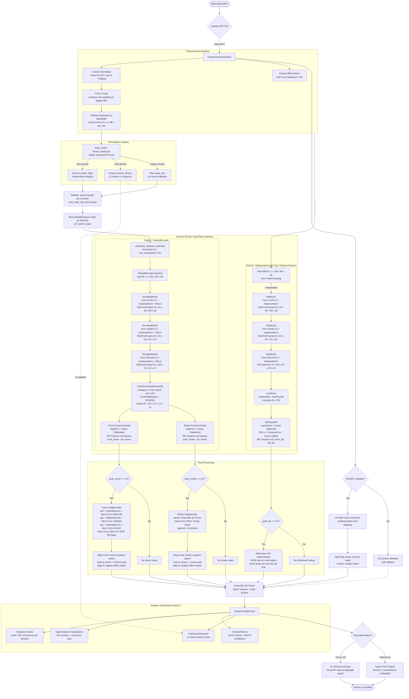

# NeuroX - Multi-Disease Brain MRI Analysis System

## 📋 Project Overview

NeuroX is an advanced deep learning system for automated detection and segmentation of brain pathologies from MRI scans. The system simultaneously analyzes three critical neurological conditions: **Brain Tumors**, **Stroke**, and **Alzheimer's Disease** using state-of-the-art 3D convolutional neural networks with uncertainty quantification.

### Project Goal

To develop a clinically-viable AI diagnostic assistant that:
- Provides accurate multi-disease detection from a single MRI scan
- Generates precise 3D visualizations of brain pathology
- Quantifies diagnostic uncertainty for clinical decision support
- Meets publication-grade statistical rigor for medical AI research

## ⚡ Quick Start

Get the system running in under 5 minutes:

1.  **Clone & Install**:
    ```bash
    git clone https://github.com/SaiKarthik547/Capstone.git
    cd Capstone
    pip install -r requirements.txt
    pip install HD-BET
    ```

2.  **Download Models**:
    - Place `ferrari_model.pth` in the project root (generated by `neurox_train_kaggle.py`).
    - (Optional) Download HD-BET weights if not automatic.

3.  **Run**:
    ```bash
    streamlit run neurox_adaptive.py
    ```

---

## ⚠️ Disclaimer

**IMPORTANT LEGAL AND CLINICAL NOTICES:**

🚨 **NOT FOR CLINICAL USE** - This system is a research prototype and educational tool only. It is NOT approved by FDA, CE, or any regulatory body for clinical diagnosis or treatment decisions.

⚠️ **REQUIRES EXPERT SUPERVISION** - All outputs must be reviewed and validated by qualified medical professionals (radiologists, neurologists). AI predictions are assistive only and cannot replace human clinical judgment.

⚠️ **RESEARCH PURPOSES ONLY** - This software is intended for academic research, algorithm development, and educational demonstrations. Any clinical application requires proper regulatory approval and validation studies.

⚠️ **NO WARRANTY** - Provided "as-is" without any guarantees of accuracy, reliability, or fitness for any particular purpose. Users assume all risks.

⚠️ **DATA PRIVACY** - Users are responsible for ensuring compliance with HIPAA, GDPR, and other applicable data protection regulations when processing medical images.

---

## ✨ Key Features

### Multi-Label Disease Detection
- ✅ Simultaneous detection of Tumor, Stroke, and Alzheimer's Disease
- ✅ Independent probability scores (diseases are NOT mutually exclusive)
- ✅ One patient can have multiple conditions simultaneously

### Medical-Grade Brain Extraction
- ✅ HD-BET (Heidelberg Brain Extraction Tool) for accurate skull stripping
- ✅ Separates brain tissue from skull, scalp, and facial structures
- ✅ Essential for accurate 3D visualization

### 3D Visualization
- ✅ Interactive 3D brain mesh rendering
- ✅ Lesion overlay with anatomically accurate positioning
- ✅ Color-coded pathology visualization

### Uncertainty Quantification
- ✅ Monte Carlo Dropout for epistemic uncertainty estimation
- ✅ Confidence scores for each prediction
- ✅ Helps identify cases requiring expert review

### Clinical Metrics
- ✅ Comprehensive evaluation: Precision, Recall, F1-Score
- ✅ Sensitivity, Specificity, PPV, NPV
- ✅ Volumetric measurements in mm³ and mL
- ✅ ROC curves and calibration analysis

---

## 🛠️ Technology Stack

### Core Framework
- **Python 3.8+** - Primary programming language
- **PyTorch 2.0+** - Deep learning framework
- **CUDA 11.8+** - GPU acceleration (optional)

### Medical Imaging
- **NiBabel** - NIfTI file I/O
- **HD-BET** - Medical-grade brain extraction
- **Scikit-image** - Image processing and marching cubes
- **SciPy** - Scientific computing and morphological operations

### Deep Learning Architecture
- **3D CNN Encoder** - Shared feature extraction (`enc1`→`enc2`→`enc3`→`bottleneck`)
- **Transformer Bottleneck** - Global context modeling (depth=4, heads=8, mlp=256)
- **Tumor & Stroke PresenceHeads** - Bottleneck → AdaptiveAvgPool → FC classifier
- **AlzheimerEncoder** - Raw MRI → 3× Conv3D blocks → dual pool (avg+max, 256-dim) → MLP → logit (fully independent)
- **Attention-Gated U-Net Decoders** - Tumor (3-class) and Stroke (binary) segmentation
- **InstanceNorm3d** - Normalization for small-batch stability
- **Metrics-embedded Checkpoints** - `ferrari_model.pth` stores weights + full training history

### Visualization
- **Streamlit** - Web application framework
- **Plotly** - Interactive 3D graphics
- **Trimesh** - 3D mesh processing
- **Matplotlib** - 2D plotting and analysis

### Evaluation & Statistics
- **Scikit-learn** - ML metrics and evaluation
- **Iterative-stratification** - Multi-label cross-validation
- **NumPy** - Numerical computing
- **Pandas** - Data analysis (optional)

### Report Generation
- **ReportLab** - PDF report creation
- **Groq AI** - Optional AI-powered insights (requires API key)

---

## 📦 Installation

### 1. Clone Repository
```bash
git clone https://github.com/SaiKarthik547/Capstone.git
cd Capstone
```

### 2. Install Python Dependencies
```bash
pip install -r requirements.txt
```

**Required packages:**
```
torch>=2.0.0
nibabel>=5.0.0
numpy>=1.24.0
scipy>=1.10.0
scikit-image>=0.20.0
scikit-learn>=1.3.0
streamlit>=1.28.0
plotly>=5.17.0
trimesh>=4.0.0
matplotlib>=3.7.0
reportlab>=4.0.0
iterative-stratification>=0.1.7
```

### 3. Install HD-BET (Medical-Grade Brain Extraction)
```bash
pip install HD-BET
```
**Verify installation:**
```bash
hd-bet -h
```
If successful, you should see HD-BET help documentation.

### 4. Download Model Weights
**Essential:**
1.  **NeuroX Model**: Download `neurox_multihead_final.pth` (21.6 MB) and place it in the **root directory** (`neurox/`).
    - [Download Link Placeholder]

**Optional (for 3D Brain Extraction):**
2.  **HD-BET Weights**: The system attempts to download these automatically. If it fails, download `hd-bet_params.folder` and place in `~/.hd-bet/`.

---

## 🚀 Usage

### Running the Application
```bash
streamlit run neurox_adaptive.py
```
The web interface will open automatically at `http://localhost:8501`.

### Workflow

1. **Upload MRI Scan**
   - Supported formats: `.nii`, `.nii.gz` (NIfTI)
   - Recommended: T1-weighted, T2-weighted, or FLAIR sequences
   - File size: Typically 5-50 MB

2. **Automatic Analysis** (takes 30-60 seconds)
   - Brain extraction using HD-BET
   - Multi-label disease detection
   - Lesion segmentation (Tumor/Stroke)
   - Uncertainty quantification
   - 3D mesh generation

3. **Review Results**
   - **Detection Tab**: Probability scores for each disease
   - **3D Visualization**: Interactive brain mesh with lesions
   - **Metrics Tab**: Volumetric measurements and statistics
   - **AI Insights**: Optional AI-generated clinical summary

4. **Export Report**
   - Download comprehensive PDF report
   - Includes all visualizations and metrics
   - Timestamped for record-keeping

---

## 📊 Evaluation System

The project includes a comprehensive evaluation framework for publication-grade validation:

### Running Tests
```bash
python run_evaluation_test.py
```

**Expected output:**
```
✅ TEST 1 PASSED: Comprehensive metrics
✅ TEST 2 PASSED: Temperature scaling  
✅ TEST 3 PASSED: ROC operating points
✅ TEST 4 PASSED: Decision curve analysis
✅ TEST 5 PASSED: Power analysis
```

### Evaluation Modules
- **`evaluation/nested_cv.py`** - Nested cross-validation, multi-label stratification
- **`evaluation/calibration.py`** - Temperature scaling, calibration metrics
- **`evaluation/statistical_rigor.py`** - IoU matching, decision curves, power analysis
- **`evaluation/run_evaluation.py`** - Main evaluation orchestrator

---

## 🏗️ System Architecture

### 🧠 Class Diagram — NeuroX Ferrari Architecture

```mermaid
classDiagram
    direction TB

    class NeuroXMultiDisease {
        +encoder : SharedEncoder
        +presence_heads : ModuleDict
        +seg_decoders : ModuleDict
        +alz_encoder : AlzheimerEncoder
        +forward(x, active_presence, active_seg) dict
    }

    class SharedEncoder {
        +in_channels : int = 1
        +forward(x) dict[enc1, enc2, enc3, bottleneck]
    }

    class EncoderBlock1 {
        +Conv3d(1, 32, k=3, p=1) x2
        +InstanceNorm3d(32, affine=True)
        +ReLU inplace=True
        +input  [B, 1, 96, 96, 96]
        +output [B, 32, 96, 96, 96]
        +MaxPool3d(2) gives [B, 32, 48, 48, 48]
    }

    class EncoderBlock2 {
        +Conv3d(32, 64, k=3, p=1) x2
        +InstanceNorm3d(64, affine=True)
        +ReLU inplace=True
        +input  [B, 32, 48, 48, 48]
        +output [B, 64, 48, 48, 48]
        +MaxPool3d(2) gives [B, 64, 24, 24, 24]
    }

    class EncoderBlock3 {
        +Conv3d(64, 128, k=3, p=1) x2
        +InstanceNorm3d(128, affine=True)
        +ReLU inplace=True
        +input  [B, 64, 24, 24, 24]
        +output [B, 128, 24, 24, 24]
        +MaxPool3d(2) gives [B, 128, 12, 12, 12]
    }

    class TransformerBottleneck3D {
        +dim : int = 128
        +depth : int = 4
        +heads : int = 8
        +mlp_dim : int = 256
        +dropout : float = 0.1
        +tokens : int = 1728 (12x12x12)
        +reshape input [B,128,12,12,12] to [B,1728,128]
        +4x PreNorm + MultiHeadAttention(8 heads)
        +4x PreNorm + FeedForward(128 to 256 to 128)
        +reshape output [B,1728,128] to [B,128,12,12,12]
    }

    class PresenceHead_Tumor {
        +in_features : int = 128
        +AdaptiveAvgPool3d(output=1)
        +Flatten gives [B, 128]
        +Linear(128, 64)
        +ReLU
        +Dropout(p=0.3)
        +Linear(64, 1) gives logit [B,1]
        +BCEWithLogitsLoss
        +MC-Dropout: 10 stochastic passes at inference
        +output: mean_prob_tumor and std_tumor
    }

    class PresenceHead_Stroke {
        +in_features : int = 128
        +AdaptiveAvgPool3d(output=1)
        +Flatten gives [B, 128]
        +Linear(128, 64)
        +ReLU
        +Dropout(p=0.3)
        +Linear(64, 1) gives logit [B,1]
        +BCEWithLogitsLoss
        +MC-Dropout: 10 stochastic passes at inference
        +output: mean_prob_stroke and std_stroke
    }

    class AlzheimerEncoder {
        +FULLY INDEPENDENT: zero shared params
        +raw MRI input [B, 1, 96, 96, 96]
        +forward(x) logit [B, 1]
        +MC-Dropout: classifier.train() x10 passes
    }

    class AlzBlock1 {
        +Conv3d(1, 32, k=3, p=1, bias=False) x2
        +InstanceNorm3d(32)
        +ReLU
        +input  [B, 1, 96, 96, 96]
        +MaxPool3d(2) gives [B, 32, 48, 48, 48]
    }

    class AlzBlock2 {
        +Conv3d(32, 64, k=3, p=1, bias=False) x2
        +InstanceNorm3d(64)
        +ReLU
        +input  [B, 32, 48, 48, 48]
        +MaxPool3d(2) gives [B, 64, 24, 24, 24]
    }

    class AlzBlock3 {
        +Conv3d(64, 128, k=3, p=1, bias=False) x2
        +InstanceNorm3d(128)
        +ReLU
        +input  [B, 64, 24, 24, 24]
        +NO MaxPool: output [B, 128, 24, 24, 24]
    }

    class AlzDualPool {
        +AdaptiveAvgPool3d(1) flatten gives [B, 128]
        +AdaptiveMaxPool3d(1) flatten gives [B, 128]
        +torch.cat([avg, max], dim=1) gives [B, 256]
        +AvgPool: captures global cortical atrophy
        +MaxPool: captures focal hippocampal peaks
    }

    class AlzClassifier {
        +LayerNorm(256)
        +Linear(256, 128)
        +GELU
        +Dropout(p=0.4)
        +Linear(128, 1) gives logit [B, 1]
        +BCEWithLogitsLoss
        +output: mean_prob_alz and std_alz
    }

    class AttentionGate_L3 {
        +W_gate : Conv3d(128, 64, k=1)
        +W_skip : Conv3d(128, 64, k=1)
        +psi    : Conv3d(64, 1, k=1)
        +forward: add then ReLU then psi then Sigmoid
        +alpha multiplied by enc3 skip
        +spatial scale: 12 to 24
    }

    class AttentionGate_L2 {
        +W_gate : Conv3d(64, 32, k=1)
        +W_skip : Conv3d(64, 32, k=1)
        +psi    : Conv3d(32, 1, k=1)
        +forward: add then ReLU then psi then Sigmoid
        +alpha multiplied by enc2 skip
        +spatial scale: 24 to 48
    }

    class AttentionGate_L1 {
        +W_gate : Conv3d(32, 16, k=1)
        +W_skip : Conv3d(32, 16, k=1)
        +psi    : Conv3d(16, 1, k=1)
        +forward: add then ReLU then psi then Sigmoid
        +alpha multiplied by enc1 skip
        +spatial scale: 48 to 96
    }

    class TumorDecoder {
        +output_channels : int = 3
        +labels: ET(4) NCR(1) ED(2)
        +up3: ConvTranspose3d(128,128,k=2,s=2)
        +dec3: Conv3d(256,128,k=3) x2 InstanceNorm
        +up2: ConvTranspose3d(128,64,k=2,s=2)
        +dec2: Conv3d(128,64,k=3) x2 InstanceNorm
        +up1: ConvTranspose3d(64,32,k=2,s=2)
        +dec1: Conv3d(64,32,k=3) x2 InstanceNorm
        +head: Conv3d(32, 3, k=1) full-res logits
        +loss: 0.5 x DiceLoss + 0.5 x FocalLoss(gamma=2, alpha=0.25)
    }

    class StrokeDecoder {
        +output_channels : int = 1
        +label: binary infarct mask
        +up3: ConvTranspose3d(128,128,k=2,s=2)
        +dec3: Conv3d(256,128,k=3) x2 InstanceNorm
        +up2: ConvTranspose3d(128,64,k=2,s=2)
        +dec2: Conv3d(128,64,k=3) x2 InstanceNorm
        +up1: ConvTranspose3d(64,32,k=2,s=2)
        +dec1: Conv3d(64,32,k=3) x2 InstanceNorm
        +head: Conv3d(32, 1, k=1) full-res logits
        +loss: 0.5 x DiceLoss + 0.5 x FocalLoss(gamma=2, alpha=0.5)
    }

    class TrainingConfig {
        +optimizer: AdamW(lr=2e-4, wd=1e-5)
        +alz_encoder group lr: 1e-4 (LR x 0.5)
        +scheduler: CosineAnnealingLR(T_max=20, eta_min=1e-6)
        +epochs=25, batch_size=1, ROI=96x96x96
        +Stage A ep1-5:   lambda_cls=1.5
        +Stage B ep6-15:  lambda_cls=1.5
        +Stage C ep16-25: lambda_cls=1.0
        +lambda_tumor=1.0, lambda_stroke=1.0
        +grad_clip: max_norm=1.0
        +AMP: autocast + GradScaler
        +seed=42, round-robin batch order
    }

    class CheckpointFile {
        +file: ferrari_model.pth
        +key[model_state]: OrderedDict weights
        +key[metrics][tumor_et]: list len=N_epochs
        +key[metrics][tumor_ncr]: list len=N_epochs
        +key[metrics][tumor_ed]: list len=N_epochs
        +key[metrics][tumor_mean]: list len=N_epochs
        +key[metrics][stroke_dice]: list len=N_epochs
        +key[metrics][alz_auc]: list len=N_epochs
        +key[metrics][alz_accuracy]: list len=N_epochs
        +key[metrics][alz_precision]: list len=N_epochs
        +key[metrics][alz_recall]: list len=N_epochs
        +key[metrics][alz_f1]: list len=N_epochs
    }

    NeuroXMultiDisease *-- SharedEncoder
    NeuroXMultiDisease *-- PresenceHead_Tumor
    NeuroXMultiDisease *-- PresenceHead_Stroke
    NeuroXMultiDisease *-- AlzheimerEncoder
    NeuroXMultiDisease *-- TumorDecoder
    NeuroXMultiDisease *-- StrokeDecoder
    SharedEncoder *-- EncoderBlock1
    SharedEncoder *-- EncoderBlock2
    SharedEncoder *-- EncoderBlock3
    SharedEncoder *-- TransformerBottleneck3D
    TumorDecoder *-- AttentionGate_L3
    TumorDecoder *-- AttentionGate_L2
    TumorDecoder *-- AttentionGate_L1
    StrokeDecoder *-- AttentionGate_L3
    StrokeDecoder *-- AttentionGate_L2
    StrokeDecoder *-- AttentionGate_L1
    AlzheimerEncoder *-- AlzBlock1
    AlzheimerEncoder *-- AlzBlock2
    AlzheimerEncoder *-- AlzBlock3
    AlzheimerEncoder *-- AlzDualPool
    AlzheimerEncoder *-- AlzClassifier
    NeuroXMultiDisease ..> TrainingConfig : trained with
    NeuroXMultiDisease ..> CheckpointFile : saved to / loaded from
```



---

### 🔄 Application Workflow



---

## 📁 Project Structure

```
neurox/
├── .github/                   # GitHub workflows (CI/CD)
├── assets/                    # Static assets
│   └── brain/                 # Brain atlas templates (FreeSurfer)
├── evaluation/                # Evaluation & Validation System
│   ├── calibration.py         # Reliability diagrams & temperature scaling
│   ├── nested_cv.py           # Nested Cross-Validation (5x2)
│   ├── run_evaluation.py      # Main evaluation orchestrator
│   └── statistical_rigor.py   # Statistical tests (McNemar, t-tests)
├── release_v1.5.0/            # Local HD-BET model weights
├── LICENSE                    # MIT License
├── README.md                  # Project Documentation
├── neurox_adaptive.py         # 🚀 Main Application (Streamlit)
├── ferrari_model.pth          # 🧠 Trained Model Weights + Metrics History
├── neurox_train_kaggle.py     # Training Pipeline (Ferrari Architecture)
└── requirements.txt           # Dependency Requirements
```

---

## 🔧 Configuration

### Environment Variables

```bash
# Disable Groq AI (offline mode)
export NEUROX_OFFLINE=true

# GPU selection
export CUDA_VISIBLE_DEVICES=0
```

### Model Configuration

Edit `neurox_adaptive.py` (lines 94-98):

```python
DEVICE = torch.device("cuda" if torch.cuda.is_available() else "cpu")
ROI_SIZE = (96, 96, 96)
PRESENCE_THRESHOLD = 0.5
MODEL_PATH = r"path/to/neurox_multihead_final.pth"
```

---

## 🐛 Troubleshooting

### HD-BET Not Found

```bash
pip install HD-BET
hd-bet -h  # Verify installation
```

If HD-BET is unavailable, 3D visualization will be disabled (safe fallback).

### CUDA Out of Memory

Use CPU mode:
```python
DEVICE = torch.device("cpu")
```

Or reduce batch size in training script.

### Import Errors

```bash
pip install -r requirements.txt --force-reinstall
```

---

## 📚 Scientific References

1. **HD-BET:** Isensee et al., "Automated brain extraction of multisequence MRI using artificial neural networks" (2019)
2. **Nested CV:** Varma & Simon, "Bias in error estimation when using cross-validation for model selection" (2006)
3. **Temperature Scaling:** Guo et al., "On Calibration of Modern Neural Networks" (ICML 2017)
4. **Monte Carlo Dropout:** Gal & Ghahramani, "Dropout as a Bayesian Approximation" (2016)
5. **Decision Curves:** Vickers & Elkin, "Decision Curve Analysis" (2006)
6. **Multi-Label Stratification:** Sechidis et al., "On the stratification of multi-label data" (2011)

---

## 📄 License

**Academic and Research Use Only**

This software is provided for educational and research purposes. Commercial use, clinical deployment, or any application involving patient care requires:
- Proper regulatory approval (FDA, CE, etc.)
- Clinical validation studies
- Institutional review board (IRB) approval
- Separate licensing agreement

---

## 👥 Contributors

**Sai Karthik** - Project Lead & Development

---

## 📧 Contact & Support

For technical questions, bug reports, or collaboration inquiries:
- **GitHub Issues:** [Report a bug](https://github.com/SaiKarthik547/Capstone/issues)
- **Documentation:** See `evaluation/README.md` for detailed evaluation docs

---

## 🎯 Future Enhancements

- [ ] External validation on independent datasets
- [ ] Additional disease categories (hemorrhage, MS lesions)
- [ ] Real-time inference optimization
- [ ] Multi-sequence fusion (T1 + T2 + FLAIR)
- [ ] Longitudinal analysis (disease progression tracking)
- [ ] Integration with PACS systems

---

**Version:** 2.0.0 — Ferrari Architecture
**Last Updated:** February 19, 2026
**Status:** ✅ Research Prototype - Production-Grade Code Quality
